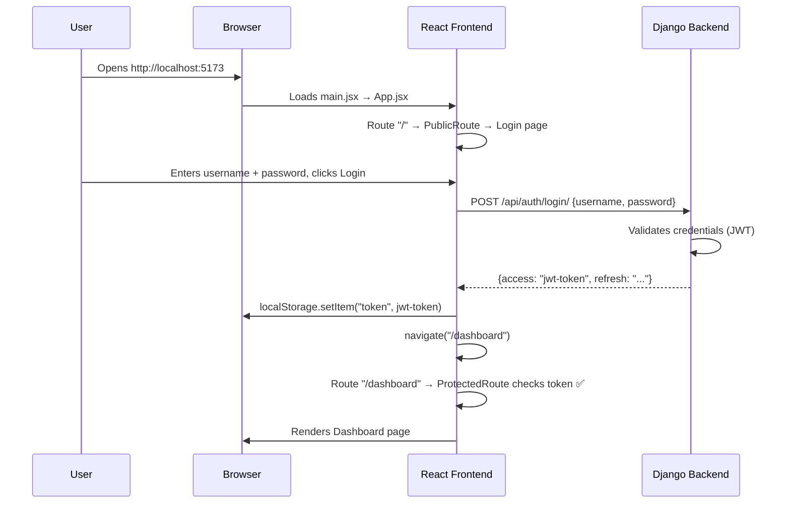

# SmartPlatform – Project Walkthrough

## How to Run

```bash
# Terminal 1 — Backend (Django)
cd backend-django
python manage.py runserver          # Starts at http://127.0.0.1:8000

# Terminal 2 — Frontend (React + Vite)
cd frontend-react
npm run dev                         # Starts at http://localhost:5173
```

---

## Project Structure Overview

```
smart-platform/
├── backend-django/           ← Django REST API (Python)
│   ├── core/                 ← Django project settings & root URLs
│   ├── authentication/       ← User registration & JWT login
│   ├── study_module/         ← Study notes, quizzes, expenses
│   ├── manage.py             ← Django entry point
│   └── db.sqlite3            ← SQLite database
│
└── frontend-react/           ← React + Vite SPA (JavaScript)
    └── src/
        ├── main.jsx          ← App entry point
        ├── App.jsx           ← All routes defined here
        ├── services/api.js   ← Axios HTTP client
        ├── pages/            ← Full-page components
        ├── components/       ← Reusable UI + auth guards
        └── styles/           ← Tailwind CSS config
```

---

## Execution Flow (Login → Dashboard)



---

## Frontend Files — What Each File Does

### Entry Point

| File | Role |
|------|------|
| `main.jsx` | Mounts the React app into the DOM. Imports `global.css` for Tailwind styles. |
| `App.jsx` | **Router — defines ALL page routes.** Maps URL paths to page components and wraps them with auth guards. |

### Pages (Full-Screen Views)

| File | Route | What It Does |
|------|-------|--------------|
| `Login.jsx` | `/` | Login form. Sends `POST /api/auth/login/` → saves JWT token → navigates to `/dashboard`. |
| `Signup.jsx` | `/signup` | Registration form. Sends `POST /api/auth/register/` → creates new user. |
| `Dashboard.jsx` | `/dashboard` | Main landing page after login. Shows stat cards (Study Notes, AI Summaries, Quizzes, Expenses) and a welcome banner with links. |
| `StudyHelper.jsx` | `/study` | Study notes manager. Can add notes, upload PDFs, view AI summaries, and generate quizzes. Calls `/api/study/` endpoints. |
| `ExpenseTracker.jsx` | `/expenses` | Expense tracker. Add expenses by category (Food, Travel, etc.), view list, and see analytics. Calls `/api/study/expense/` endpoints. |

### Components (Reusable Parts)

| File | What It Does |
|------|--------------|
| `ProtectedRoute.jsx` | **Auth guard.** Checks if JWT token exists in localStorage. ✅ Token exists → show the page. ❌ No token → redirect to login (`/`). |
| `PublicRoute.jsx` | **Reverse auth guard.** If user is already logged in (has token) → redirect to `/dashboard`. Prevents logged-in users from seeing login/signup pages. |
| `Navbar.jsx` | Top navigation bar shown inside Dashboard/Study/Expenses. Has page title and a **Logout** button (removes token + redirects to `/`). |
| `Sidebar.jsx` | Left sidebar navigation. Links to Study Helper, Analytics, and Expenses. Highlights the currently active page. |
| `DashboardCard.jsx` | A reusable stat card component (currently unused placeholder). |

### Services

| File | What It Does |
|------|--------------|
| `services/api.js` | Creates an Axios instance with `baseURL: http://127.0.0.1:8000/api`. All API calls throughout the app use this shared instance. |

### Styles

| File | What It Does |
|------|--------------|
| `styles/global.css` | Imports Tailwind CSS (`@import "tailwindcss"`) and sets default body background/font. |

---

## Backend Files — What Each File Does

### Core (Project Config)

| File | What It Does |
|------|--------------|
| `manage.py` | Django CLI entry point. Run `python manage.py runserver` from `backend-django/` folder. |
| `core/settings.py` | All Django settings: installed apps, database (SQLite), CORS (allows all origins), JWT auth config, media uploads path. |
| `core/urls.py` | **Root URL router.** Maps: `/api/auth/` → authentication app, `/api/study/` → study_module app. |
| `core/views.py` | Simple home view (health check). |

### Authentication App

| File | What It Does |
|------|--------------|
| `models.py` | Custom `User` model extending Django's `AbstractUser`. Adds a `bio` field. |
| `serializers.py` | `RegisterSerializer` — validates and creates new users (username, email, password). |
| `views.py` | `register_user` — POST endpoint to create a new account. |
| `urls.py` | Routes: `POST /api/auth/register/` → register, `POST /api/auth/login/` → JWT token (built-in), `POST /api/auth/refresh/` → refresh token. |

### Study Module App

| File | What It Does |
|------|--------------|
| `models.py` | Database models: `StudyNote` (title, content, summary, PDF), `Quiz` (question + 4 options + answer), `Expense` (title, amount, category). |
| `views.py` | All API logic — 7 endpoints (see table below). |
| `serializers.py` | Converts `StudyNote` model ↔ JSON. |
| `expense_serializers.py` | Converts `Expense` model ↔ JSON. |
| `quiz_serializers.py` | Converts `Quiz` model ↔ JSON. |
| `ai_summary.py` | `generate_summary()` — generates AI summary of note content. |
| `pdf_utils.py` | `extract_text_from_pdf()` — extracts text from uploaded PDF files. |
| `quiz_generator.py` | `generate_quiz()` — generates quiz questions from note content. |
| `urls.py` | Maps all `/api/study/` sub-routes to view functions. |

### API Endpoints Summary

| Method | URL | Auth? | What It Does |
|--------|-----|-------|-------------|
| POST | `/api/auth/register/` | ❌ | Create new user |
| POST | `/api/auth/login/` | ❌ | Get JWT token (login) |
| POST | `/api/auth/refresh/` | ❌ | Refresh expired token |
| POST | `/api/study/add/` | ✅ | Add a study note |
| GET | `/api/study/all/` | ✅ | Get all user's notes |
| POST | `/api/study/upload-pdf/` | ✅ | Upload PDF → extract text → create note |
| POST | `/api/study/generate-quiz/` | ✅ | Generate quiz from a note |
| GET | `/api/study/quiz/<note_id>/` | ✅ | Get quiz for a specific note |
| POST | `/api/study/expense/add/` | ✅ | Add an expense |
| GET | `/api/study/expense/all/` | ✅ | Get all user's expenses |
| GET | `/api/study/expense/analytics/` | ✅ | Get expense totals by category |

---

## Key Concepts

### JWT Authentication Flow
1. User logs in → backend returns `access` + `refresh` tokens
2. Frontend saves `access` token in `localStorage`
3. `ProtectedRoute` checks for token before showing protected pages
4. For API calls needing auth, the token should be sent as `Authorization: Bearer <token>` header

### How Routing Works
- `App.jsx` defines all routes using React Router
- Public pages (`/`, `/signup`) are wrapped in `PublicRoute` — redirects to dashboard if already logged in
- Protected pages (`/dashboard`, `/study`, `/expenses`) are wrapped in `ProtectedRoute` — redirects to login if not authenticated
